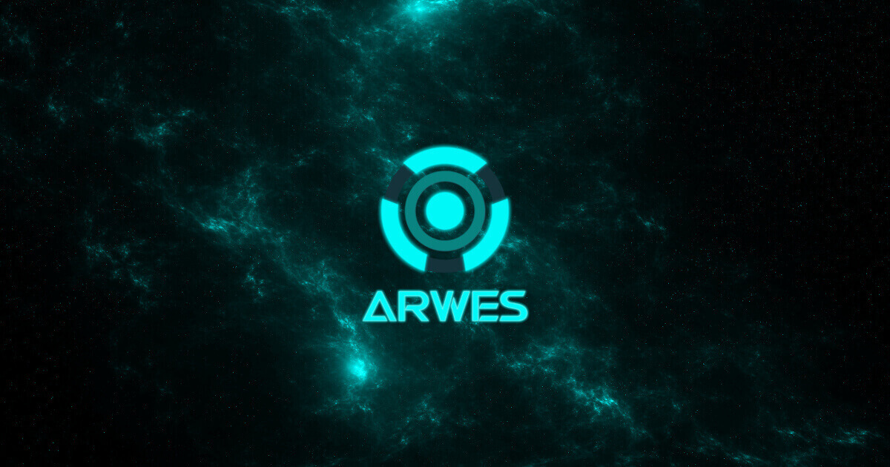

<!-- markdownlint-disable MD033 MD013 -->

  

  Futuristic Sci-Fi UI Web Framework

    
    
    
    
    
    

    
    
    
    
    

----

[Arwes](https://arwes.dev) is a web framework to build user interfaces based on
futuristic science fiction designs, animations, and sound effects. The concepts
behind are opinionated with influences from [Cyberprep](https://aesthetics.fandom.com/wiki/Cyberprep),
[Cyberpunk](https://en.wikipedia.org/wiki/Cyberpunk), and [Synthwave](https://en.wikipedia.org/wiki/Synthwave),
and productions like [Star Citizen](http://robertsspaceindustries.com),
[Halo](https://www.halowaypoint.com/en-us/games), and [TRON: Legacy](http://www.imdb.com/title/tt1104001).
It tries to inspire advanced space and alien technology.

> The project is under development as alpha release. See [project details](https://arwes.dev/project).

## Documentation

See **[arwes.dev](https://arwes.dev)**.

The previous version was moved to [version1-breakpoint1.arwes.dev](https://version1-breakpoint1.arwes.dev)
with the branch [`version1-breakpoint1`](https://github.com/arwes/arwes/tree/version1-breakpoint1)
where you can find the components and the website source code. This package was
released in February, 2018, and **it is now deprecated**.

## Community

### Apps

<!-- ARWES-COMMUNITY-APPS:START -->
<table>
<tr>
<td align="center"> <a href="https://soulextract.com">SoulExtract.com</a> <a href="https://github.com/soulextract/soulextract.com">soulextract/soulextract.com</a></td>
<td align="center"> <a href="https://romelperez.dev">RomelPerez.dev</a> <a href="https://github.com/romelperez/romelperez.dev">romelperez/romelperez.dev</a></td>
</tr>
</table>
<!-- ARWES-COMMUNITY-APPS:END -->

## Need help?

Open [a GitHub issue](https://github.com/arwes/arwes/issues/new/choose) or let's
chat on [Discord](https://discord.gg/s5sbTkw).

Review [frequently asked questions](https://arwes.dev/project/faq) and
[code of conduct](https://arwes.dev/community/code-of-conduct).

## Roadmap

Check out [roadmap](https://arwes.dev/project/roadmap) and [project boards](https://github.com/arwes/arwes/projects).

## Contributors

<!-- ALL-CONTRIBUTORS-LIST:START - Do not remove or modify this section -->
<!-- prettier-ignore-start -->
<!-- markdownlint-disable -->
<table>
  <tr>
    <td align="center"><a href="https://RomelPerez.dev"> <b>Romel Pérez</b></a> <a href="#projectManagement-romelperez" title="Project Management">📆</a> <a href="https://github.com/arwes/arwes/commits?author=romelperez" title="Code">💻</a> <a href="https://github.com/arwes/arwes/commits?author=romelperez" title="Tests">⚠️</a> <a href="https://github.com/arwes/arwes/commits?author=romelperez" title="Documentation">📖</a></td>
    <td align="center"><a href="https://nickwe.st"> <b>Nick West</b></a> <a href="https://github.com/arwes/arwes/commits?author=njwest" title="Documentation">📖</a> <a href="#ideas-njwest" title="Ideas, Planning, & Feedback">🤔</a> <a href="#research-njwest" title="Research">🔬</a> <a href="#infra-njwest" title="Infrastructure (Hosting, Build-Tools, etc)">🚇</a></td>
    <td align="center"><a href="https://github.com/jdpnielsen"> <b>Joshua Pratt</b></a> <a href="https://github.com/arwes/arwes/commits?author=jdpnielsen" title="Code">💻</a> <a href="https://github.com/arwes/arwes/pulls?q=is%3Apr+reviewed-by%3Ajdpnielsen" title="Reviewed Pull Requests">👀</a></td>
  </tr>
</table>

<!-- markdownlint-restore -->
<!-- prettier-ignore-end -->

<!-- ALL-CONTRIBUTORS-LIST:END -->

This project follows the [all-contributors](https://github.com/kentcdodds/all-contributors)
specification.

## Want to contribute?

The project is not fully open for sustancial contributions yet until the
first beta version is released and the [project guidelines](https://arwes.dev/project/guidelines)
are finished. But you can follow the development in [Discord](https://discord.gg/s5sbTkw)
and [Twitter](https://twitter.com/arwesjs).
