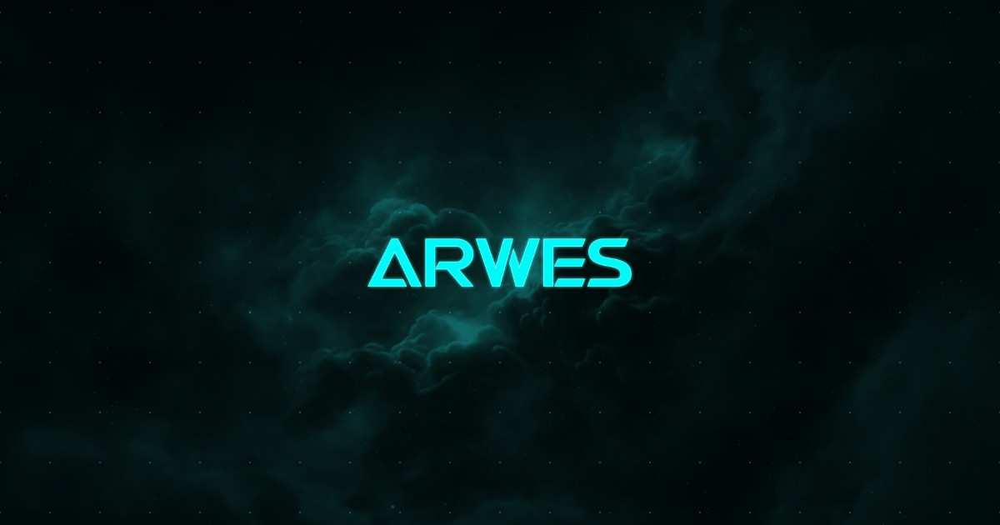

<!-- markdownlint-disable MD033 MD013 MD028 -->

<div align="center">
  
</div>

<p align="center" style="margin-top: 16px; font-size: 1.2rem;">
  Futuristic Sci-Fi UI Web Framework
</p>

<div align="center">
  <a href="https://npmjs.org/package/arwes">
    
  </a>
  <a href="https://github.com/arwes/arwes">
    
  </a>
  <a href="https://npmjs.org/package/arwes">
    
  </a>
  <a href="https://github.com/arwes/arwes/blob/main/LICENSE">
    
  </a>
</div>

---

[ARWES](https://arwes.dev) is a web framework to build user interfaces based on futuristic science fiction designs, animations, and sound effects. The concepts behind are opinionated with influences from [Cyberprep](https://aesthetics.fandom.com/wiki/Cyberprep) and productions like [Star Citizen](http://robertsspaceindustries.com), [Halo](https://www.halowaypoint.com/en-us/games), [NIKKE](https://nikke-en.com), and [Mecha Break](https://www.mechabreak.com/index). It tries to inspire advanced science and technology.

> **The ARWES project is no longer maintained and currently outdated but it is still functional and operational. Feel free to fork it for your own personal use.**

## Packages

### Vanilla

[](https://bundlephobia.com/package/arwes)
[](https://bundlephobia.com/package/arwes)

Core of the framework. Vanilla packages do not have major external dependencies but most tools are
low level APIs and sometimes require elaborated setups. Other implementation packages
simplify its use.

### React

[](https://bundlephobia.com/package/@arwes/react)
[](https://bundlephobia.com/package/@arwes/react)

ARWES offers [React](https://react.dev) v18 specific packages with SSR support.
ARWES does not work with React strict mode nor React Server Components.

## Community

### Apps

<!-- ARWES-COMMUNITY-APPS:START -->
<table>
<tr>
<td align="center"><a href="https://zknet.io"></a><br /><a href="https://zknet.io">ZKN</a></td>
<td align="center"><a href="https://soulextract.com"></a><br /><a href="https://soulextract.com">SoulExtract.com</a></td>
<td align="center"><a href="https://romelperez.dev"></a><br /><a href="https://romelperez.dev">RomelPerez.dev</a></td>
<td align="center"><a href="https://archiverpg.com"></a><br /><a href="https://archiverpg.com">Archive RPG</a></td></tr>
<tr><td align="center"><a href="https://cmdb.wrick17.com"></a><br /><a href="https://cmdb.wrick17.com">Cyber Movie Database</a></td>
<td align="center"><a href="https://beko.famkos.net/category/simpit"></a><br /><a href="https://beko.famkos.net/category/simpit">Primary Buffer Panel</a></td>
<td align="center"><a href="https://universe-dawn.com"></a><br /><a href="https://universe-dawn.com">Universe Dawn</a></td>
<td align="center"><a href="https://www.reddit.com/r/reactjs/comments/p6x6j7/show_rreactjs_badgeth_a_scifi_dapp_built_with/"></a><br /><a href="https://www.reddit.com/r/reactjs/comments/p6x6j7/show_rreactjs_badgeth_a_scifi_dapp_built_with/">Badgeth</a></td></tr>
<tr><td align="center"><a href="https://darkgalaxies.io"></a><br /><a href="https://darkgalaxies.io">Dark Galaxies</a></td>
<td align="center"><a href="https://cybersocial.herokuapp.com"></a><br /><a href="https://cybersocial.herokuapp.com">inCyberPunk</a></td>
<td align="center"><a href="https://beko.famkos.net/tag/streamoverlay"></a><br /><a href="https://beko.famkos.net/tag/streamoverlay">Stream Overlay</a></td>
<td align="center"><a href="https://blog.starwards.space"></a><br /><a href="https://blog.starwards.space">StarWards</a></td></tr>
<tr><td align="center"><a href="https://www.myxouz.com/2021/12/lady-of-shalott-first-version-of-our-home-dashboard/"></a><br /><a href="https://www.myxouz.com/2021/12/lady-of-shalott-first-version-of-our-home-dashboard/">Lady of the Shalott</a></td>
<td align="center"><a href="https://www.indiedb.com/games/assembly-rts"></a><br /><a href="https://www.indiedb.com/games/assembly-rts">Assembly RTS</a></td>
<td align="center"><a href="https://paingthet.com"></a><br /><a href="https://paingthet.com">paingthet.com</a></td>
<td align="center"><a href="https://glitchy.website"></a><br /><a href="https://glitchy.website">glitchy.website</a></td>
</tr>
</table>
<!-- ARWES-COMMUNITY-APPS:END -->

### Contributors

<!-- ALL-CONTRIBUTORS-LIST:START - Do not remove or modify this section -->
<!-- prettier-ignore-start -->
<!-- markdownlint-disable -->
<table>
  <tbody>
    <tr>
      <td align="center" valign="top" width="20%"><a href="https://RomelPerez.dev"><br /><sub><b>Romel Pérez</b></sub></a><br /><a href="#projectManagement-romelperez" title="Project Management">📆</a> <a href="https://github.com/arwes/arwes/commits?author=romelperez" title="Code">💻</a> <a href="https://github.com/arwes/arwes/commits?author=romelperez" title="Tests">⚠️</a> <a href="https://github.com/arwes/arwes/commits?author=romelperez" title="Documentation">📖</a></td>
      <td align="center" valign="top" width="20%"><a href="https://nickwe.st"><br /><sub><b>Nick West</b></sub></a><br /><a href="https://github.com/arwes/arwes/commits?author=njwest" title="Documentation">📖</a> <a href="#ideas-njwest" title="Ideas, Planning, & Feedback">🤔</a> <a href="#research-njwest" title="Research">🔬</a> <a href="#infra-njwest" title="Infrastructure (Hosting, Build-Tools, etc)">🚇</a></td>
      <td align="center" valign="top" width="20%"><a href="https://github.com/jdpnielsen"><br /><sub><b>Joshua Pratt</b></sub></a><br /><a href="https://github.com/arwes/arwes/commits?author=jdpnielsen" title="Code">💻</a> <a href="https://github.com/arwes/arwes/pulls?q=is%3Apr+reviewed-by%3Ajdpnielsen" title="Reviewed Pull Requests">👀</a></td>
      <td align="center" valign="top" width="20%"><a href="https://github.com/Dessix"><br /><sub><b>Zoey</b></sub></a><br /><a href="#ideas-Dessix" title="Ideas, Planning, & Feedback">🤔</a> <a href="https://github.com/arwes/arwes/pulls?q=is%3Apr+reviewed-by%3ADessix" title="Reviewed Pull Requests">👀</a></td>
      <td align="center" valign="top" width="20%"><a href="https://github.com/amir-arad"><br /><sub><b>Amir Arad</b></sub></a><br /><a href="https://github.com/arwes/arwes/issues?q=author%3Aamir-arad" title="Bug reports">🐛</a> <a href="https://github.com/arwes/arwes/commits?author=amir-arad" title="Code">💻</a></td>
    </tr>
    <tr>
      <td align="center" valign="top" width="20%"><a href="https://github.com/StephenCodesThings"><br /><sub><b>Stephen Bennett</b></sub></a><br /><a href="https://github.com/arwes/arwes/issues?q=author%3AStephenCodesThings" title="Bug reports">🐛</a> <a href="https://github.com/arwes/arwes/commits?author=StephenCodesThings" title="Code">💻</a></td>
      <td align="center" valign="top" width="20%"><a href="https://github.com/TheNetAdmin"><br /><sub><b>Zixuan Wang</b></sub></a><br /><a href="https://github.com/arwes/arwes/issues?q=author%3ATheNetAdmin" title="Bug reports">🐛</a> <a href="https://github.com/arwes/arwes/commits?author=TheNetAdmin" title="Code">💻</a></td>
      <td align="center" valign="top" width="20%"><a href="https://www.frityet.net/"><br /><sub><b>Frityet</b></sub></a><br /><a href="#financial-Frityet" title="Financial">💵</a></td>
      <td align="center" valign="top" width="20%"><a href="https://github.com/AthelesE"><br /><sub><b>AthelesE</b></sub></a><br /><a href="#financial-AthelesE" title="Financial">💵</a></td>
      <td align="center" valign="top" width="20%"><a href="https://github.com/r4mbhardwaj"><br /><sub><b>Ram</b></sub></a><br /><a href="#financial-r4mbhardwaj" title="Financial">💵</a></td>
    </tr>
  </tbody>
</table>

<!-- markdownlint-restore -->
<!-- prettier-ignore-end -->

<!-- ALL-CONTRIBUTORS-LIST:END -->

_This project follows the [all-contributors](https://github.com/kentcdodds/all-contributors)
specification._

## Workflow

Using [Node.js](http://nodejs.org) v20.

### Setup

Install and build all packages:

```bash
npm install
npm run build
```

### Applications

Open an app in development mode:

```bash
npx turbo dev -F apps-docs
npx turbo dev -F apps-play
npx turbo dev -F apps-perf
```

### Packages

Build and watch a package in development mode:

```bash
npx turbo dev -F @arwes/animated
# ...
```

### Production

Build production website at the `./www` folder and open it:

```bash
npm run www
npm run serve
open http://localhost:3000
```
