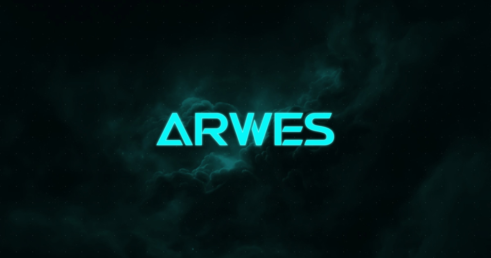

<!-- markdownlint-disable MD033 MD013 MD028 -->

  

  Futuristic Sci-Fi UI Web Framework

  
  
  
  
  
  
  
  

----

[Arwes](https://arwes.dev) is a web framework to build user interfaces based on
futuristic science fiction designs, animations, and sound effects. The concepts
behind are opinionated with influences from [Cyberprep](https://aesthetics.fandom.com/wiki/Cyberprep)
and [Synthwave](https://en.wikipedia.org/wiki/Synthwave),
and productions like [Star Citizen](http://robertsspaceindustries.com),
[Halo](https://www.halowaypoint.com/en-us/games), and [TRON: Legacy](http://www.imdb.com/title/tt1104001).
It tries to inspire advanced science and technology.

> The project is under development and not ready for production yet. It is still in
[alpha release](https://stackoverflow.com/questions/40067469), so the components
are being tested and their API may change as it gets completed.

> Branch [`main`](https://github.com/arwes/arwes/tree/main) is for `1.0.0-alpha`
releases and public content deployed at [arwes.dev](https://arwes.dev).

> Branch [`next`](https://github.com/arwes/arwes/tree/next) is for `1.0.0-next`
releases and active development deployed at [next.arwes.dev](https://next.arwes.dev).

> The previous version `@arwes/[package]@1.0.0-alpha.19` was moved to [version1-breakpoint2.arwes.dev](https://version1-breakpoint2.arwes.dev)
and [playground.version1-breakpoint2.arwes.dev](https://playground.version1-breakpoint2.arwes.dev)
with the branch [`version1-breakpoint2`](https://github.com/arwes/arwes/tree/version1-breakpoint2)
where you can find the components, the playground, and the website source code. This version
was released in April, 2021, and it is now deprecated.

> The previous version `arwes@1.0.0-alpha.5` was moved to [version1-breakpoint1.arwes.dev](https://version1-breakpoint1.arwes.dev)
with the branch [`version1-breakpoint1`](https://github.com/arwes/arwes/tree/version1-breakpoint1)
where you can find the components and the website source code. This version was
released in February, 2018, and it is now deprecated.

## Packages

### Vanilla

Package | Status | Description
---|---|---
`@arwes/tools` |  Polishing | General React API tools
`@arwes/theme` | Development | Color, units, and general purpose dynamic theming tools
`@arwes/animated` | Polishing | HTML element animation utilities
`@arwes/animator` | Polishing | Assemble and disassemble user interfaces using animation controls
`@arwes/bleeps` | Polishing | Define, manage, and control interactive short sound effects
`@arwes/text` | Polishing | Text rendering effect tools
`@arwes/frames` | Polishing | Build responsive vector graphics components
`@arwes/bgs` | Development | Passive UI background effects
`@arwes/core` | Development | Core UI functionalities
`arwes` | Polishing | All vanilla packages bundle

### React

Package | Status | Description
---|---|---
`@arwes/react-tools` | Polishing | General browser API tools
`@arwes/react-animator` | Polishing | Animator interface tools
`@arwes/react-animated` | Polishing | Animated UI elements using animator tools
`@arwes/react-bleeps` | Polishing | Interactive short sound effects manager
`@arwes/react-text` | Polishing | Text effect components
`@arwes/react-frames` | Polishing | Build responsive vector graphics components
`@arwes/react-bgs` | Polishing | Passive UI background effects
`@arwes/react-core` | Specification | Core UI components
`@arwes/react` | Polishing | All vanilla and React packages bundle

## Community

### Apps

<!-- ARWES-COMMUNITY-APPS:START -->
<table>
<tr>
<td align="center"> <a href="https://soulextract.com">SoulExtract.com</a> <a href="https://github.com/soulextract/soulextract.com">soulextract/soulextract.com</a></td>
<td align="center"> <a href="https://romelperez.dev">RomelPerez.dev</a> --</td>
<td align="center"> <a href="https://www.reddit.com/r/reactjs/comments/p6x6j7/show_rreactjs_badgeth_a_scifi_dapp_built_with/">Badgeth</a> --</td></tr>
<tr><td align="center"> <a href="https://darkgalaxies.io">Dark Galaxies</a> --</td>
<td align="center"> <a href="https://cybersocial.herokuapp.com">inCyberPunk</a> <a href="https://github.com/inPhoenix/inCyberPunk2022">inPhoenix/inCyberPunk2022</a></td>
<td align="center"> <a href="https://beko.famkos.net/tag/streamoverlay">Stream Overlay</a> --</td></tr>
<tr><td align="center"> <a href="https://archiverpg.com">ArchiveRPG.com</a> --</td>
<td align="center"> <a href="https://blog.starwards.space">StarWards</a> <a href="https://github.com/starwards/starwards">starwards/starwards</a></td>
<td align="center"> <a href="https://cmdb.wrick17.com">Cyber Movie Database</a> <a href="https://github.com/wrick17/cmdb">wrick17/cmdb</a></td></tr>
<tr><td align="center"> <a href="https://www.myxouz.com/2021/12/lady-of-shalott-first-version-of-our-home-dashboard/">Lady of the Shalott</a> --</td>
<td align="center"> <a href="https://www.indiedb.com/games/assembly-rts">Assembly RTS</a> --</td>
<td align="center"> <a href="https://universe-dawn.com">Universe Dawn</a> --</td></tr>
<tr><td align="center"> <a href="https://paingthet.com">paingthet.com</a> --</td>
<td align="center"> <a href="https://beko.famkos.net/category/simpit">Primary Buffer Panel</a> --</td>
</tr>
</table>
<!-- ARWES-COMMUNITY-APPS:END -->

### Similars

- [Augmented UI](https://augmented-ui.com)

## Need help?

Open [a GitHub issue](https://github.com/arwes/arwes/issues/new/choose) or let's
chat on [Discord](https://discord.gg/s5sbTkw).

Review [frequently asked questions](./FAQ.md) and [code of conduct](./.github/CODE_OF_CONDUCT.md).

## Roadmap

Check out [Project Task Boards](https://github.com/arwes/arwes/projects).

## Contributors

<!-- ALL-CONTRIBUTORS-LIST:START - Do not remove or modify this section -->
<!-- prettier-ignore-start -->
<!-- markdownlint-disable -->
<table>
  <tbody>
    <tr>
      <td align="center" valign="top" width="20%"><a href="https://RomelPerez.dev"> <b>Romel Pérez</b></a> <a href="#projectManagement-romelperez" title="Project Management">📆</a> <a href="https://github.com/arwes/arwes/commits?author=romelperez" title="Code">💻</a> <a href="https://github.com/arwes/arwes/commits?author=romelperez" title="Tests">⚠️</a> <a href="https://github.com/arwes/arwes/commits?author=romelperez" title="Documentation">📖</a></td>
      <td align="center" valign="top" width="20%"><a href="https://nickwe.st"> <b>Nick West</b></a> <a href="https://github.com/arwes/arwes/commits?author=njwest" title="Documentation">📖</a> <a href="#ideas-njwest" title="Ideas, Planning, & Feedback">🤔</a> <a href="#research-njwest" title="Research">🔬</a> <a href="#infra-njwest" title="Infrastructure (Hosting, Build-Tools, etc)">🚇</a></td>
      <td align="center" valign="top" width="20%"><a href="https://github.com/jdpnielsen"> <b>Joshua Pratt</b></a> <a href="https://github.com/arwes/arwes/commits?author=jdpnielsen" title="Code">💻</a> <a href="https://github.com/arwes/arwes/pulls?q=is%3Apr+reviewed-by%3Ajdpnielsen" title="Reviewed Pull Requests">👀</a></td>
      <td align="center" valign="top" width="20%"><a href="https://github.com/Dessix"> <b>Zoey</b></a> <a href="#ideas-Dessix" title="Ideas, Planning, & Feedback">🤔</a> <a href="https://github.com/arwes/arwes/pulls?q=is%3Apr+reviewed-by%3ADessix" title="Reviewed Pull Requests">👀</a></td>
      <td align="center" valign="top" width="20%"><a href="https://github.com/amir-arad"> <b>Amir Arad</b></a> <a href="https://github.com/arwes/arwes/issues?q=author%3Aamir-arad" title="Bug reports">🐛</a> <a href="https://github.com/arwes/arwes/commits?author=amir-arad" title="Code">💻</a></td>
    </tr>
    <tr>
      <td align="center" valign="top" width="20%"><a href="https://github.com/StephenCodesThings"> <b>Stephen Bennett</b></a> <a href="https://github.com/arwes/arwes/issues?q=author%3AStephenCodesThings" title="Bug reports">🐛</a> <a href="https://github.com/arwes/arwes/commits?author=StephenCodesThings" title="Code">💻</a></td>
      <td align="center" valign="top" width="20%"><a href="https://github.com/TheNetAdmin"> <b>Zixuan Wang</b></a> <a href="https://github.com/arwes/arwes/issues?q=author%3ATheNetAdmin" title="Bug reports">🐛</a> <a href="https://github.com/arwes/arwes/commits?author=TheNetAdmin" title="Code">💻</a></td>
    </tr>
  </tbody>
</table>

<!-- markdownlint-restore -->
<!-- prettier-ignore-end -->

<!-- ALL-CONTRIBUTORS-LIST:END -->

This project follows the [all-contributors](https://github.com/kentcdodds/all-contributors)
specification.

## Want to contribute?

The project is not fully open for sustancial contributions yet until the
first beta version is released. Follow the development on
[Discord](https://discord.gg/s5sbTkw) and [Twitter](https://twitter.com/arwesjs).
