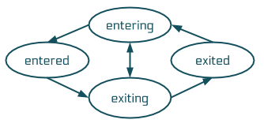
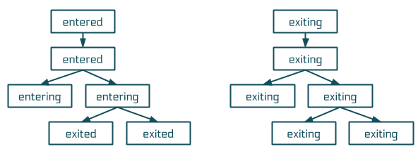

# Animation System

The Arwes Animation System is composed by a set of tools which follow the
[Arwes Animation and Sounds Guidelines](../../guidelines/animation-and-sounds.md)
implemented from React components. It goes hand in hand with the [Sounds System](../sounds/sounds-system.md).

## Nodes

- An animated component is a "node".
- An application is a "system". A tree of nodes with a root.
- A sub-system is a branch of the system. Starting from a node as root.
- The animation is a "flow" of states in the nodes.
- A node can have one of the following four animation flow states:
    - `exited` - Transitioned out. The animation is completed and the component
    is hidden. If component is animated, this will be always its initial state.
    - `entering` - Transitioning in. The animations are assembling the component.
    - `entered` - Transitioned in. The animation is completed and component
    is shown. If component is not animated, this will be always its state.
    - `exiting` - Transitioning out. Animations are disassembling the component.
- A node can only have the following changes between flow states:



- The animation flow "enters" from parent nodes to children nodes.
- By default, a system nodes are `exited` and when activated, the nodes begin
entering level by level.
- Flow "enters" in a node when it changes from `exited` to `entering` to `entered`.
- For a node to enter:
    - It is a "root node" and it is activated to enter.
    - Its parent was changed to `entered`.
    - It is controlled by its parent component.
- The animation flow "exits" from a root node to all its descendant nodes at
the same time, or it is controlled by its parent. So it is recommended to have
the same exit duration for all nodes.
- Flow "exits" in a node when it changes from `entered` to `exiting` to `exited`.



- By default, a node is animated.
- A node is added to the system as `exited` if animation is enabled. According
to its configuration, it could start entering or stay in the same state.
- If a node is removed from the system and it is as `entered` or `entering`,
it should start `exiting` and completely removed from the DOM when `exited`.

## `Energy`

The `Energy` component is an interface used to control the animation flow
in a component. It represents a node in the system.

> This component is not used directly, instead it is used by a HOC (High Order Component).

### Props

- `animate: boolean = true` - Enable animations.
- `root: boolean` - Animation operates independently from its parent node,
making it a root node. (Any node is root if it does not have a parent node.)
- `activate: boolean = true` - Activate animation flow if it is a root node.
Otherwise this component animation will be controlled externally, not this prop.
- `duration: number | Object` - Duration settings for this node. If number is
provided, it only specifies `enter` and `exit` times. Any duration is set in
milliseconds.
    - `enter: number = 200` - The duration the component lasts entering.
    - `exit: number = 200` - The duration the component lasts exiting.
    - `delay: number = 0` - Time to delay before transitioning to `entered`.
    - `offset: number = 0` - When this node is child of `Stream`, this is the
    time to delay before transitioning to `entered` from this node and the
    following nodes.
- `merge: boolean` - If enabled and it is not a root node, the node will enter
in the flow when its parent changes to `entering`.
- `imperative: boolean = false` - If `true`, the flow state is controlled
imperatively, not declaratively.
- `onActivation: Function(boolean)` - Get notified when the node is activated or
deactivated.

### Methods

- `getFlow(): flow` - Returns the current node flow state.
- `hasEntered(): boolean` - If the node has transitioned to `entered` at least once.
- `hasExited(): boolean` - If the node has transitioned to `exited` at least once.
- `getDuration(): Object` - Get the node duration values.
- `updateDuration(duration: number | Object)` - Update the animation duration.
- `updateActivation(boolean)` - Updates the node flow activation with provided
value. Applicable if: `imperative = true`.

> To access these APIs, you would use an object referenced as `EnergyInterface`.

## `AnimationProvider`

There can be a provider (a React context provider) in the system to setup
default animation settings to all descendant nodes.

The available props are: `animate` and `duration`.

The descendant nodes will extend those props if available and defined.

The providers can be stacked and their props will be extended.

### Example

```js
<AnimationProvider animate duration={{ enter: 250 }}>
    <App />
</AnimationProvider>
```

## `withEnergy`

Any component can be wired to the animation flow using a HOC named `withEnergy`.
This will convert a component into an animation node in the system. It uses the
`Energy` component under the hood.

### Options

The HOC can receive options as an object defining the default options the
nodes will take: `animate`, `root`, `merge`, and `duration`. It can also
take the following options:

- `cycles: boolean = true` - If the component should enable the flow actions on
this component: `enter` and `exit` methods will be required on the component.

```js
const options = { cycles: false, root: true, duration: { delay: 1000 } };
const MyNode = withEnergy(options)(MyComponent);
```

### Component Props Provided

When a component uses the HOC, it can receive the animation settings by the
object prop named `energy`.

```js
<MyNode energy={{ root: true, activate: false }} />
```

### Component Props Received

And the node component will receive the following props:

- `energy: EnergyInterface` - An interface to access the `Energy`
component instance API.
    - `flow: Object` - The animation flow state. It indicates in which point
    of the animation flow the component is.
        - `value: string` - One of `entering`, `entered`, `exiting`, `exited`.
        - `entering: boolean`
        - `entered: boolean`
        - `exiting: boolean`
        - `exited: boolean`

```js
MyComponent.propTypes = {
    energy: PropTypes.object.isRequired
    ...
}
const MyNode = withEnergy()(MyComponent);
```

### Cycles

The node component should implement two methods, `enter` and `exit`, unless
the HOC receives option `cycles = false` or `animate = false`. The methods
will be called when the node in the flow has to enter or exit.

```js
class MyComponent extends React.PureComponent {
    enter () { /* Run animations on entering. */ }
    exit () { /* Run animations on exiting. */ }
}
const MyNode = withEnergy()(MyComponent);
```

The node component should use these methods or the flow states to animate
the component elements. The actual animation functionalities are up to the
component to implement.

## `Stream`

A stream of energies. The `Stream` virtual component can be used to handle
multiple flow changes in many node children. The nodes do not necessarily have
to be direct children.

This component is an extension of `Energy` component.

### Props

- `serial: boolean = false` - By default, when the node enters in the flow,
its children nodes will [stagger](https://css-tricks.com/staggering-animations/)
in the animation. For example, if `duration.stagger = 50`, the first node
will transition to `entering` at `0ms`, the second at `50ms`, the third at `100ms`,
and so on. If `true`, the nodes will transition to `entering` one after the
previous one finishes. The first one will still transition at `0ms`.
- `duration: Object`
    - `stagger: number = 50` - The duration to start animating between nodes
    in a list if staggering is enabled.
    - _`enter` - It is not available._
    - _`exit` - It is not available._
- _`merge` - It is not available._

### Methods

- `updateChildrenActivation(Function({ energy: EnergyInterface, component: Element, index: number }): boolean | null)` -
Iterate over each child node and depending on the returned value, it updates
the flow state. If boolean is returned, it changes the activation of the child
node, unless it is the same current value. If no value is returned, the state
remains the same. Applicable if: `imperative = true`.

### Example 1

Animate a list of nodes using a staggering strategy with 100ms between them.

```js
<ul className='list'>
    <Stream duration={{ stagger: 100 }}>
        <li className='item'>
            <MyNode />
        </li>
        <li className='item'>
            <MyNode />
        </li>
        <li className='item'>
            <MyNode />
        </li>
    </Stream>
</ul>
```

### Example 2

There is a long list of animated components inside a container element with scroll.
When the `Stream` node is mounted, and the container's scroll changes, check
the components visibility and show/hide them.

```js
class MyComponent extends React.PureComponent () {
    constructor () {
        super(...arguments);
        this.streamRef = React.createRef();
        this.containerRef = React.createRef();
    }

    componentDidMount () {
        this.updateChildrenFlow();
        containerRef.current.addEventListener('scroll', this.updateChildrenFlow);
    }

    updateChildrenFlow = () => {
        // Assuming there is a method `isVisible` of `MyNode` to determine
        // if they are visible on browser viewport.
        streamRef.current
            .updateChildrenActivation(({ component }) => component.isVisible());
    }

    render () {
        return (
            <Stream ref={this.streamRef} imperative>
                <div ref={this.containerRef}>
                    <MyNode />
                    <MyNode />
                    <MyNode />
                    <MyNode />
                </div>
            </Stream>
        );
    }
}
```

## Animation Tools

A recommended tool to make animations using the animation flow in the components
is [animejs](https://animejs.com). But any other library can be used.
