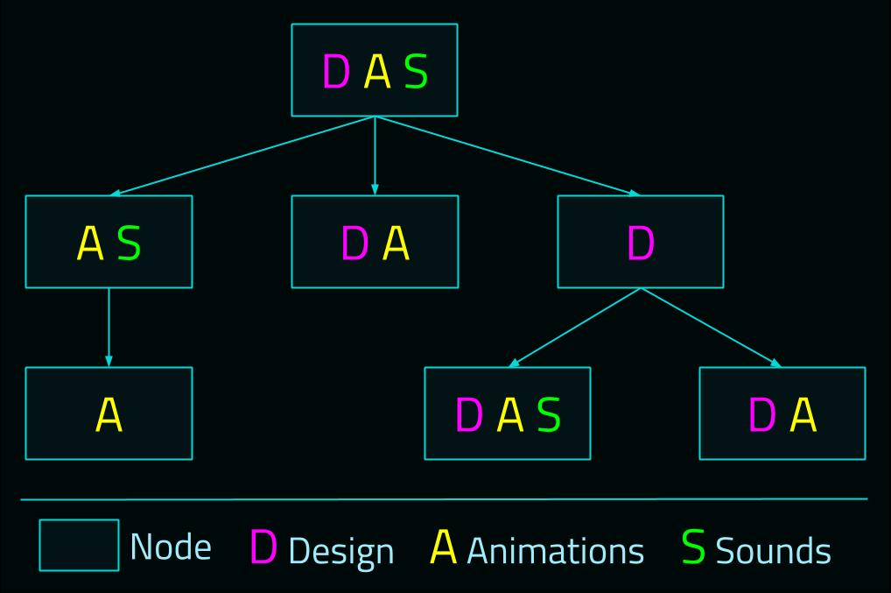
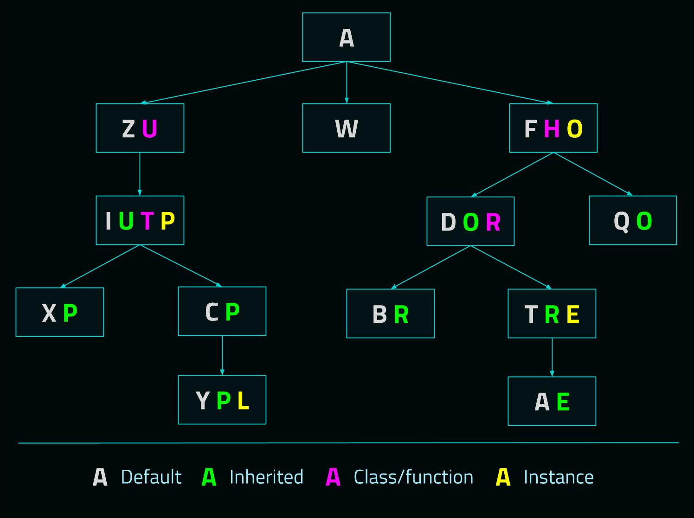

Arwes UI applications are rich in visual, animations, and sounds effects,
which can be structured as a tree of nodes.

A node represents and interactive and stateful UI component with design,
animations, and/or sounds support. The nodes in a tree are interconnected with
each other by inheriting data and communicating dynamically.

An Arwes system is an dynamically interconnected tree of nodes.

In the example, each node has defined which combination of features to use.

## Data

A node receives data as settings to configure its characteristics and behavior.
This data can be received from many sources according to the system it is part
of and its specific configuration.

Any node can have general non-specific settings which can be inherited to children
nodes. It can also have specific settings which are only applicable to the node
alone but can generate effects on other nodes.

Transition and persistent [states](../states/states.md) are defined in each node
to manage complex interface effects. These states can affect children node states.

The interactive and programatic [events](../events/events.md) specified in
a node component can change its state and behavior based on its defined settings.

## Extensibility

Nodes in a system will look for data to define its settings from different sources
in an specific order.

1) Default settings configured for the node to always start off even if it is
alone in the system.
2) Inherited settings obtained from parent nodes or certain data providers if
they exist. The node will look for the data provided by different nodes or providers
up in the tree if needed.
3) Node class or function definition settings. These settings can be extended
or overwrited.
4) Node instance settings directly defined.

A node should be listening to the system changes to react accordingly.

In the example, each of the different types of nodes will receive a value
represented as a letter. The value is extended from left to right. Priority
increases to the right. The value to the right is the one used by the node.

## Support

All nodes in a system must work with or without any of its design, animations,
or sounds features.

Arwes system functionalities depend on the foundation UI tooling to work together.
Changing the environment will result in many aspects to be limited or restricted.
